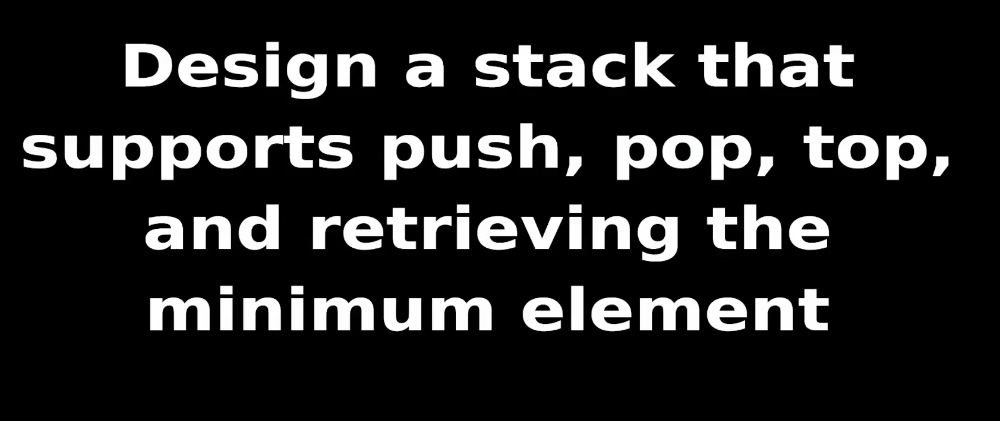

---

### Algorithm

```go
i := len(a) - 1
j := len(b) - 1
carry := 0
result := ""

for i >= 0 || j >= 0 || carry == 1 {

    if i >= 0 {
        carry += (a[i] - '0')
        i--
    }

    if j >= 0 {
        carry += (b[j] - '0')
        j--
    }
   
    result = carry + result   // add to left
  
    carry /= 2

   
}