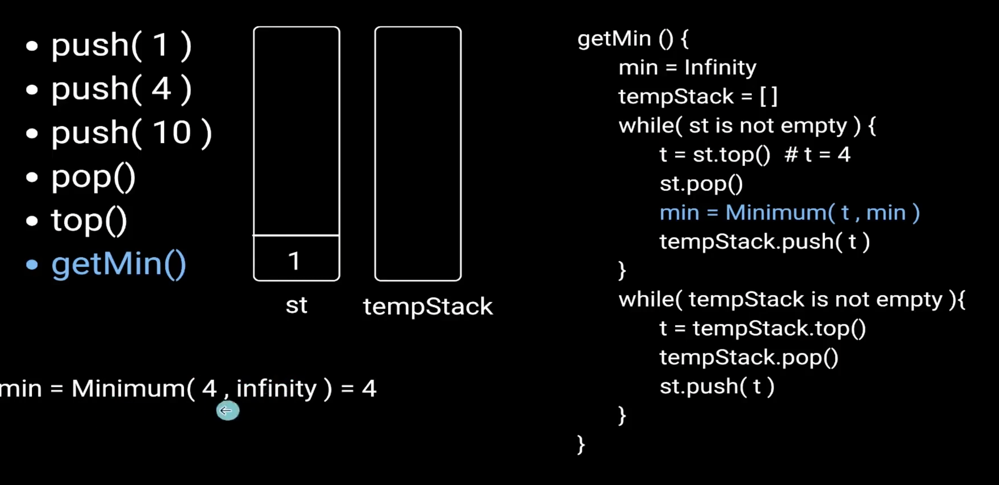

---

### Algorithm

```go
stack := []int{}
minStack := []int{}

push(val):
    stack = append(stack, val)

    if len(minStack) == 0 || val <= minStack[len(minStack)-1] {
        minStack = append(minStack, val)
    }

pop():
    top := stack[len(stack)-1]
    stack = stack[:len(stack)-1]

    if top == minStack[len(minStack)-1] {
        minStack = minStack[:len(minStack)-1]
    }

top():
    return stack[len(stack)-1]

getMin():
    return minStack[len(minStack)-1]